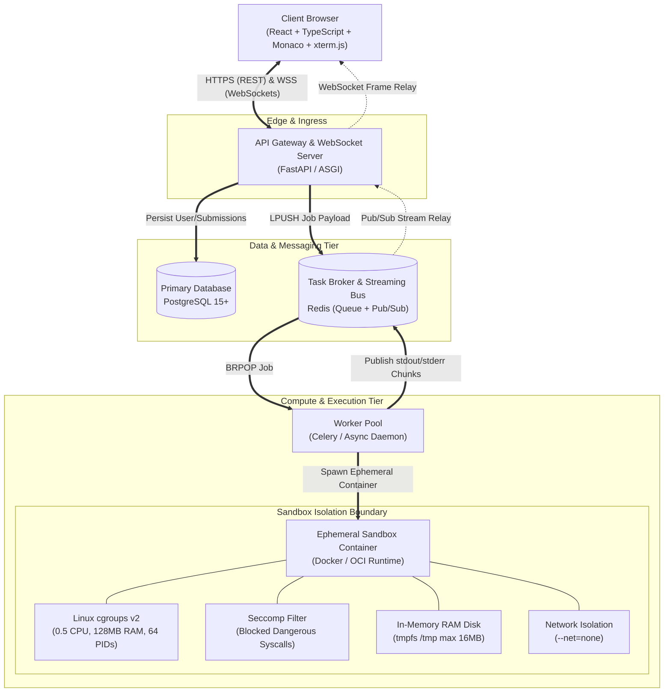

# System Architecture
## Secure Real-Time Remote Code Execution Laboratory Platform

This document describes the high-level system architecture of the platform. For full technical details, see the complete [System Architecture Specification](documentation/02_SYSTEM_ARCHITECTURE.md) and [System Design Decisions](documentation/19_SYSTEM_DESIGN_DECISIONS.md).

---

## 1. High-Level Architectural Topology

---

## 2. Core Architecture Highlights

- **Decoupled Asynchronous Processing:** FastAPI accepts submissions and buffers them in Redis, protecting the web server from compute starvation.
- **Real-Time Stream Multiplexing:** Sandbox standard output and error are streamed through Redis Pub/Sub directly to FastAPI WebSocket handlers and rendered in `xterm.js`.
- **Zero-Trust Hardened Isolation:** Unprivileged execution, read-only rootfs, in-memory `tmpfs`, zero network access (`--net=none`), and strict cgroups v2 resource quotas.
- **PostgreSQL Persistence:** ACID compliance for user accounts, submissions, and telemetry metadata.

---

## 3. Measurable Engineering Goals & Operational Limits

- **Execution Timeout:** Default **5.0 s** hard cutoff via watchdog timer.
- **CPU Limit:** **0.5 CPU core** (50% CFS scheduler quota via cgroups v2).
- **Memory Limit:** Hard limit of **128 MB** (swap disabled; OOM-killer armed).
- **Concurrency:** Target **50 concurrent streaming executions** per worker node.
- **Output Limit:** Maximum **1 MB** (or 10,000 lines) of output per run.
