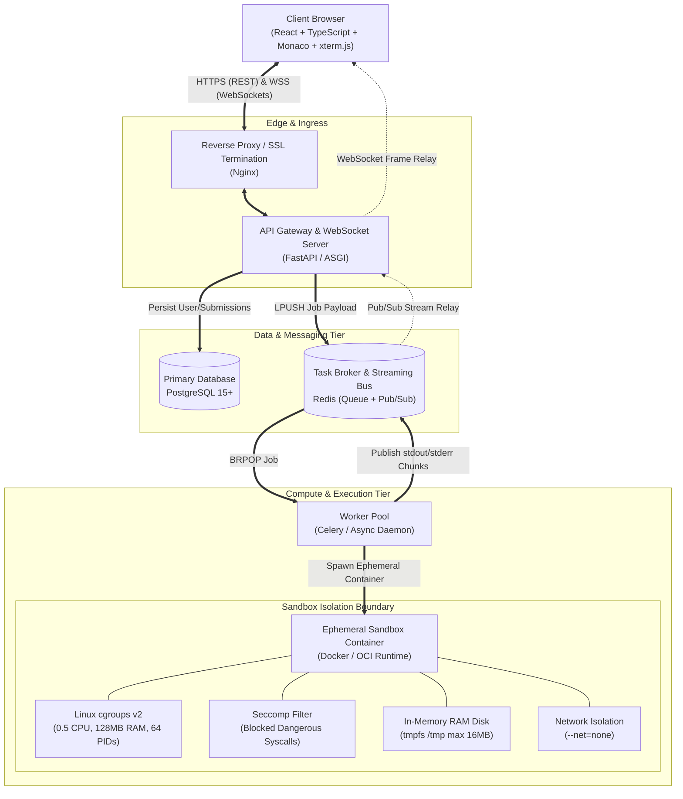

# System Architecture
## Secure Real-Time Remote Code Execution Laboratory Platform

**Document Version:** 1.0.0  
**Status:** Approved Technical Architecture  

---

## 1. High-Level Architectural Topology

The platform separates responsibilities into distinct tiers to achieve multi-tenant security, sub-second latency, and horizontal scalability:



---

## 2. Component Responsibilities

### 2.1 Presentation & Editing Tier (Frontend)
- **Code Editor (Monaco Editor):** Provides desktop-grade editor capabilities (syntax highlighting for Python 3.11, line numbers, error markers, keyboard shortcuts).
- **Virtual Terminal (xterm.js):** Emulates an ANSI terminal to render streaming output, process exit codes, and ANSI escape color sequences.
- **Client State Management:** Maintains authentication JWT tokens, local code draft persistence, and handles seamless WebSocket reconnections.

### 2.2 Ingress & Gateway Tier (FastAPI)
- **Authentication & Authorization:** Issues and verifies cryptographically signed JWT tokens, enforcing role-based permissions (Student vs. Administrator).
- **Request Validation & Ingestion:** Enforces maximum payload size limits (64KB code limit), generates unique UUIDs for submissions, and records initial `PENDING` states in PostgreSQL.
- **WebSocket Streaming Broker:** Terminates client WebSocket connections, subscribes to the job's dedicated Redis Pub/Sub channel (`exec:<submission_id>`), and forwards streamed chunks downstream with minimal latency.

### 2.3 Decoupling & Streaming Tier (Redis)
- **Task Dispatch Buffer (FIFO Queue):** Absorbs high-concurrency submission spikes, preventing CPU overload on worker nodes.
- **Low-Latency Streaming Bus (Pub/Sub):** Routes live standard I/O chunks from executing workers to the appropriate API gateway instances.
- **Short-Term Stream Buffer:** Retains output frames in a bounded list with a 60-second TTL to allow seamless stream catch-up during client reconnections.

### 2.4 Compute & Sandbox Tier (Worker Pool + Docker Sandbox)
- **Worker Daemon:** Asynchronous consumer pulling tasks from Redis, orchestrating container creation, attaching stream listeners, and enforcing hard timeout watchdogs.
- **Hardened Sandbox:** Isolated execution runtime enforcing:
  - **cgroups v2:** CPU quota (0.5 core), memory quota (128 MB), process limit (64 PIDs).
  - **Linux Namespaces:** Isolates PID, Mount, IPC, Network, and UTS.
  - **Read-Only Rootfs:** Host filesystem and container root filesystem cannot be modified.
  - **In-Memory RAM Disk (`tmpfs`):** Writable scratch space capped at 16MB; purged instantly on container destruction.
  - **Network Isolation:** Launched with `--net=none` to eliminate SSRF and outbound network abuse.
  - **Seccomp Filters:** Rejects dangerous system calls (`ptrace`, `bpf`, `chroot`, `mount`).

---

## 3. End-to-End Execution & Streaming Sequence

```mermaid
sequenceDiagram
    autonumber
    actor User as Client Browser
    participant API as FastAPI Gateway
    participant DB as PostgreSQL
    participant Redis as Redis (Queue & Pub/Sub)
    participant Worker as Execution Worker
    participant Box as Sandbox Container

    User->>API: POST /api/v1/submissions (code, language)
    API->>DB: INSERT submission (status='PENDING')
    API->>Redis: LPUSH queue:submissions (submission_id, code)
    API-->>User: HTTP 202 Accepted {submission_id}

    User->>API: WebSocket Connect /ws/v1/submissions/{id}
    API->>Redis: SUBSCRIBE exec:{submission_id}

    Worker->>Redis: BRPOP queue:submissions
    Worker->>DB: UPDATE submission (status='RUNNING')
    Worker->>Box: Create & Start Container (cgroups, tmpfs, net=none)
    
    loop Stream Execution Output
        Box-->>Worker: stdout / stderr byte stream
        Worker->>Redis: PUBLISH exec:{id} {event: "stdout", data: "..."}
        Redis-->>API: Stream frame
        API-->>User: WebSocket Frame (rendered in xterm.js)
    end

    Box-->>Worker: Process Exit (exit_code=0, duration=120ms)
    Worker->>Box: Destroy Container (docker rm -f)
    Worker->>DB: UPDATE submission (status='COMPLETED', exit_code, metrics)
    Worker->>Redis: PUBLISH exec:{id} {event: "COMPLETED"}
    Redis-->>API: Completion Frame
    API-->>User: WebSocket Close (status=1000)
```

---

## 4. Measurable Engineering Goals & Operational Limits

1. **Execution Wall-Clock Timeout:** Hard cutoff at **5.0 seconds** (configurable up to 15.0s).
2. **CPU Resource Quota:** Hard cap of **0.5 CPU core** (50% CFS scheduler bandwidth).
3. **Memory Ceiling:** Hard limit of **128 MB** per container (swap disabled; OOM-killer armed).
4. **Concurrency Capacity:** Target **50 concurrent streaming executions** per worker host node.
5. **Output Buffer Limit:** Maximum **1 MB** (or 10,000 lines) of standard output per execution to prevent buffer exhaustion.
