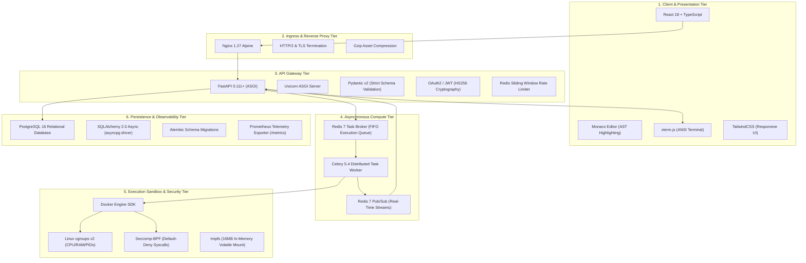

# Technology Stack & Systems Architecture
## Secure Real-Time Remote Code Execution Laboratory Platform

**Document Version:** 1.0.0  
**Target Domain:** Secure Multi-Tenant Cloud Execution & Educational Technology  

---

## 1. Complete Technology Matrix

The platform is constructed using an enterprise-grade, modern open-source technology stack:

---

## 2. Tier-by-Tier Technical Justification

### 2.1 Presentation Tier (Frontend)
| Component | Technology | Technical Justification |
| :--- | :--- | :--- |
| **Framework** | React 18 + TypeScript | Component-driven architecture with compile-time type safety preventing runtime null-pointer exceptions. |
| **Build Tool** | Vite 5 | Fast Hot Module Replacement (HMR) and Rollup-based tree-shaking for minimal production asset bundles. |
| **Code Editor** | Monaco Editor (`@monaco-editor/react`) | Web Worker-based asynchronous tokenization for Python syntax highlighting without blocking the UI rendering thread. |
| **Terminal Emulator** | `xterm.js` + `xterm-addon-fit` | Hardware-accelerated canvas/DOM virtual terminal emulator translating ANSI escape sequences (`ECMA-48`) in real time. |
| **Styling** | TailwindCSS | Utility-first CSS compiling to a microscopic production stylesheet ($< 25\text{ KB}$). |

### 2.2 API Gateway & Application Tier (Backend)
| Component | Technology | Technical Justification |
| :--- | :--- | :--- |
| **API Framework** | FastAPI | Asynchronous ASGI framework achieving high request concurrency with automatic OpenAPI documentation. |
| **Runtime Server** | Uvicorn + uvloop | Lightning-fast asyncio event loop implemented in Cython on top of libuv. |
| **Validation** | Pydantic v2 | Rust-accelerated core data validation for incoming JSON submission payloads. |
| **Authentication** | PyJWT / Passlib (Bcrypt) | Cryptographically signed, stateless JSON Web Tokens with salted Bcrypt key-derivation for passwords. |
| **Rate Limiter** | Redis Sorted Set (`ZSET`) | Distributed sliding-window log algorithm executing in atomic pipelines with `Retry-After` headers. |

### 2.3 Persistence & Storage Tier
| Component | Technology | Technical Justification |
| :--- | :--- | :--- |
| **Database** | PostgreSQL 16 Alpine | ACID-compliant relational database for structured user accounts, submissions, and execution telemetry. |
| **Async Driver** | `asyncpg` | Binary protocol PostgreSQL driver yielding high throughput on asynchronous event loops. |
| **ORM** | SQLAlchemy 2.0 (Async) | Modern asynchronous object-relational mapping preventing SQL injection vulnerabilities. |
| **Migrations** | Alembic | Version-controlled, deterministic database schema evolution. |

### 2.4 Distributed Worker & Execution Tier
| Component | Technology | Technical Justification |
| :--- | :--- | :--- |
| **Task Queue** | Celery 5.4 | Industry standard distributed task queue implementing the Competing Consumers Pattern. |
| **Message Broker** | Redis 7 Alpine | Sub-millisecond latency in-memory data store providing FIFO queueing and Append-Only File (AOF) durability. |
| **Streaming Bus** | Redis Pub/Sub | Real-time broadcast channel decoupling compute workers from API WebSocket connections. |
| **Sandbox Runtime** | Docker Engine + Python 3.12 | Micro-container isolation enforcing cgroups v2, Seccomp-BPF filters, and read-only filesystems. |

### 2.5 Observability & Telemetry Tier
| Component | Technology | Technical Justification |
| :--- | :--- | :--- |
| **Metrics Exporter** | `prometheus-client` | Formal exposition format tracking submission counters, duration histograms, and memory gauges. |
| **Logging** | Python `logging` | Structured ISO-8601 timestamps and contextual loggers streaming to stdout for container log aggregators. |
