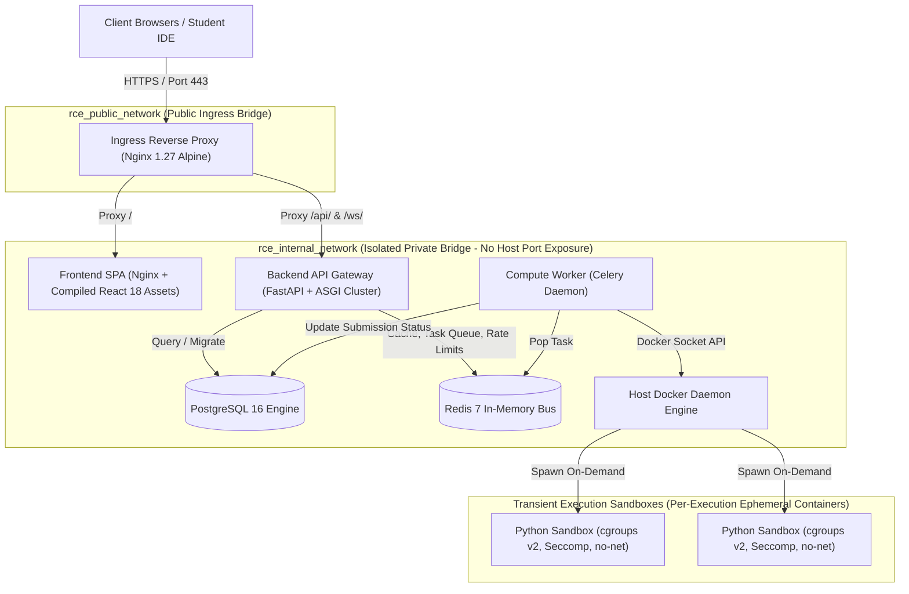

# Production Deployment Architecture Specification
## Secure Real-Time Remote Code Execution Laboratory Platform

**Document Version:** 1.0.0  
**Target Environment:** Production Cloud / Linux Virtual Private Server (VPS) / On-Premise University Lab  
**Orchestration:** Docker Compose v2 with Multi-Stage Containerization & Internal Bridge Networks  

---

## 1. Architectural Overview & Deployment Topology

The **Secure Real-Time Remote Code Execution Laboratory Platform** employs a decoupled, multi-tier microservices architecture designed for zero-trust multi-tenancy, horizontal scalability, and deterministic isolation.



---

## 2. Network Segmentation & Port Exposure

To guarantee zero-trust boundary protection, services are divided across two Docker bridge networks:

| Network Name | Scope | Attached Services | Ingress Restrictions |
| :--- | :--- | :--- | :--- |
| `rce_public_network` | Public Ingress | `nginx` | Only ports `80` (HTTP) and `443` (TLS) are bound to the host network interface (`0.0.0.0`). |
| `rce_internal_network` | Private Backplane | `nginx`, `frontend`, `backend`, `worker`, `postgres`, `redis` | **Zero host ports exposed.** Services communicate exclusively via internal Docker DNS names. PostgreSQL (5432) and Redis (6379) are unreachable from the outside world. |
| `sandbox-isolated` | Ephemeral Sandboxes | Transient execution containers | Spawned with `network_mode: none`. The container has no network stack, loopback only, and cannot reach internal services or the Internet. |

---

## 3. Production Service Specifications

### 3.1 Ingress Reverse Proxy (`nginx`)
* **Base Image:** `nginx:1.27-alpine`
* **Responsibilities:**
  1. SSL/TLS Termination with HTTP/2 and modern cipher suites.
  2. Gzip and Brotli compression for static code editor bundles.
  3. Static asset routing to the internal `frontend` service.
  4. API routing to `backend:8000` with connection keep-alive pools.
  5. WebSocket protocol upgrade handling (`Upgrade: websocket`, persistent TCP streaming).
  6. Injection of OWASP security headers (`X-Frame-Options: DENY`, `X-Content-Type-Options: nosniff`).

### 3.2 Frontend Single Page Application (`frontend`)
* **Build Pattern:** Multi-stage build (`node:20-alpine` builder $\to$ `nginx:alpine` runner).
* **Security:** Unprivileged Nginx runtime serving static, tree-shaken, and hashed JavaScript/CSS artifacts.
* **Fallback:** Nginx `try_files $uri $uri/ /index.html` ensuring client-side React Router navigation works seamlessly.

### 3.3 Backend API Gateway (`backend`)
* **Build Pattern:** Multi-stage build (`python:3.12-slim` wheel builder $\to$ `python:3.12-slim` hardened runner).
* **Process Model:** `uvicorn app.main:app --workers 4` providing asynchronous non-blocking event loop concurrency.
* **Security Profile:**
  - Non-root user: `appuser` (`UID 10001:GID 10001`).
  - Capabilities dropped: `cap_drop: ALL`, adding back only `NET_BIND_SERVICE`.
  - `no-new-privileges: true` to prevent privilege escalation via setuid binaries.
* **Healthcheck:** Probing `GET http://localhost:8000/health` verifying database pool and Redis connectivity.

### 3.4 Asynchronous Execution Worker (`worker`)
* **Build Pattern:** Multi-stage build with Docker CLI and Celery libraries.
* **Process Model:** `celery -A tasks.worker worker --loglevel=info --concurrency=4`.
* **Execution Boundary:** Connects to the host Docker daemon via `/var/run/docker.sock` to orchestrate isolated transient sandbox containers.
* **Healthcheck:** Probing Celery inspect ping (`celery -A tasks.worker inspect ping`).

### 3.5 Relational Database (`postgres`)
* **Base Image:** `postgres:16-alpine`
* **Storage:** Dedicated Docker named volume `postgres_prod_data` mounted at `/var/lib/postgresql/data`.
* **Healthcheck:** `pg_isready -U $POSTGRES_USER -d $POSTGRES_DB` ensuring readiness before API gateway initialization.

### 3.6 In-Memory Cache & Message Broker (`redis`)
* **Base Image:** `redis:7-alpine`
* **Storage:** Named volume `redis_prod_data` with Append-Only File (`--appendonly yes`) persistence.
* **Memory Policy:** Hard limit of 384MB (`--maxmemory 384mb --maxmemory-policy noeviction`) ensuring task queue integrity under memory pressure.

---

## 4. Resource Allocation & Cgroup Quotas

To prevent resource starvation, CPU and memory limits are strictly declared in `docker-compose.prod.yml`:

| Service | CPU Allocation | Memory Limit | Rationale |
| :--- | :--- | :--- | :--- |
| `nginx` | 1.00 Core | 512 MB | High-throughput SSL termination and socket multiplexing. |
| `frontend` | 0.50 Core | 256 MB | Minimal memory footprint for static Nginx file serving. |
| `backend` | 1.50 Cores | 1024 MB | Asyncpg connection pools, Pydantic validation, JWT cryptography. |
| `worker` | 2.00 Cores | 2048 MB | Docker client monitoring, I/O multiplexing, stream processing. |
| `postgres` | 1.00 Core | 1024 MB | Relational queries, WAL writes, ACID transaction guarantees. |
| `redis` | 0.50 Core | 512 MB | Single-threaded in-memory command processing and Pub/Sub routing. |
| **Sandboxes (each)** | **0.50 Core** | **128 MB** | Hard cgroups v2 constraint preventing rogue user scripts from degrading the host. |

---

## 5. Operations & Runbook

### 5.1 Initial Production Deployment
```bash
# 1. Clone repository on target production host
git clone https://github.com/farazrasul0-cmd/secure-remote-code-execution-lab.git
cd secure-remote-code-execution-lab

# 2. Configure production secrets
cp deployment/.env.production.example deployment/.env.production
nano deployment/.env.production

# 3. Build container images with BuildKit
export DOCKER_BUILDKIT=1
docker compose -f deployment/docker-compose.prod.yml --env-file deployment/.env.production build

# 4. Run database migrations
docker compose -f deployment/docker-compose.prod.yml --env-file deployment/.env.production run --rm backend alembic upgrade head

# 5. Launch all production services
docker compose -f deployment/docker-compose.prod.yml --env-file deployment/.env.production up -d
```

### 5.2 Horizontal Scaling
To scale execution throughput during high-traffic periods (e.g. university exams):
```bash
docker compose -f deployment/docker-compose.prod.yml --env-file deployment/.env.production up -d --scale worker=8
```

### 5.3 Health & Telemetry Verification
```bash
# Verify all container health statuses
docker compose -f deployment/docker-compose.prod.yml ps

# Scrape live Prometheus metrics
curl -s http://localhost/metrics | grep rce_
```
