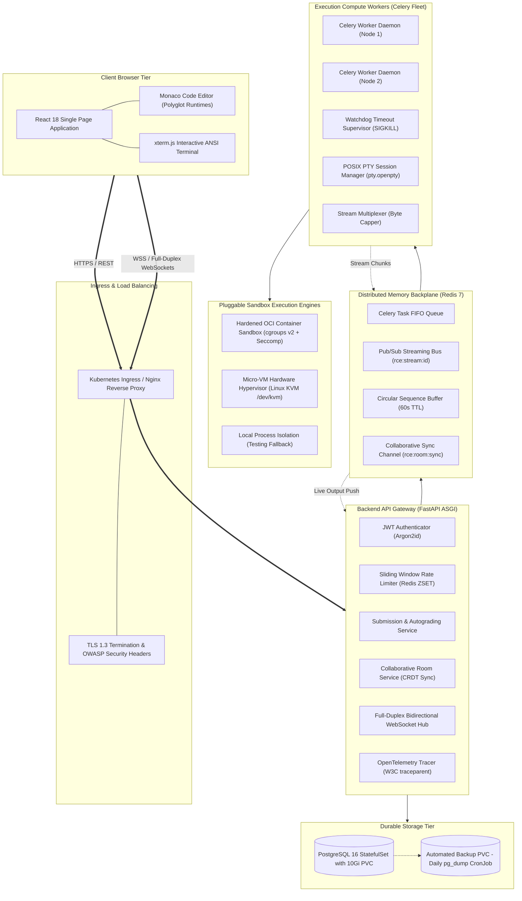
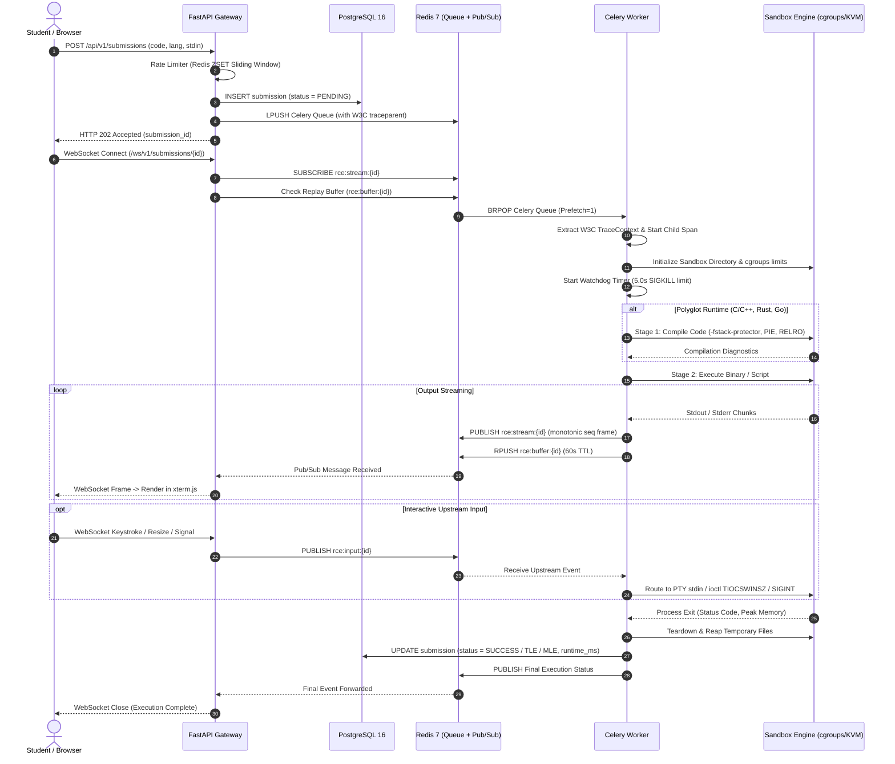
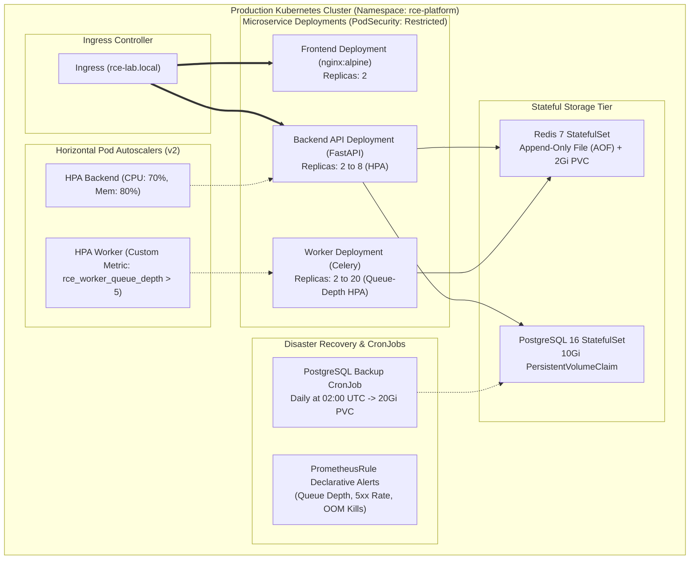
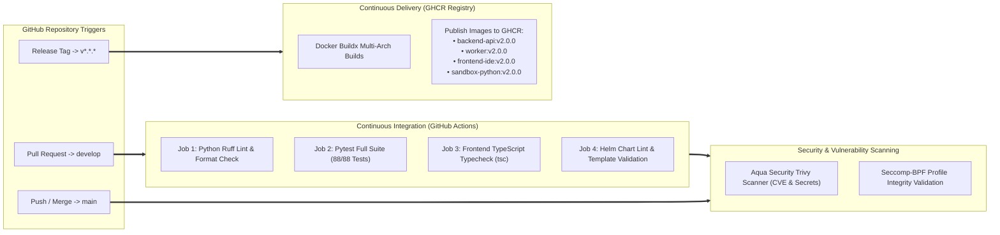
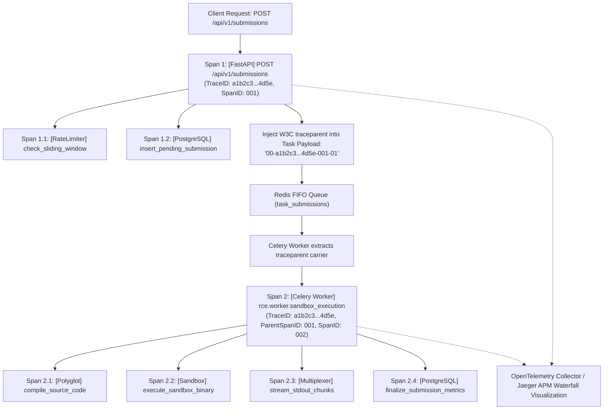

# Complete System Architecture & Operational Diagrams
## Secure Real-Time Remote Code Execution Laboratory Platform

**Document Version:** 2.0.0  
**Format:** Native GitHub Flavored Markdown / Mermaid.js  

---

## 1. Complete Distributed System Architecture

---

## 2. Six-Layer Concentric Sandbox Security Perimeter

```mermaid
flowchart LR
    UntrustedCode["Untrusted User Source Code"] --> L1

    subgraph L1 ["Layer 1: Ingress Microsegmentation"]
        Nginx["Nginx Reverse Proxy"]
        RL["Sliding Window Rate Limiter"]
        NP["K8s Default-Deny NetworkPolicy"]
    end

    L1 --> L2

    subgraph L2 ["Layer 2: Unprivileged Execution Envelope"]
        UID["Non-root UID 10001:GID 10001"]
        CapDrop["Capability Drop: CAP_DROP ALL"]
        PSS["PodSecurityStandard: Restricted"]
    end

    L2 --> L3

    subgraph L3 ["Layer 3: Namespace Boundary"]
        PIDNS["PID Namespace (Target is PID 1)"]
        NetNS["Network Namespace (--net=none)"]
        MountNS["Mount Namespace (pivot_root)"]
    end

    L3 --> L4

    subgraph L4 ["Layer 4: cgroups v2 Governance"]
        CPU["cpu.max (0.5 CPU Core CFS Quota)"]
        Mem["memory.max (128 MB Ceiling, Swap=0)"]
        PIDs["pids.max (64 Task Cap - Defeats Fork Bombs)"]
    end

    L4 --> L5

    subgraph L5 ["Layer 5: Seccomp-BPF Syscall Filter"]
        SyscallFilter["Blocks 350+ Dangerous Syscalls (ptrace, bpf, mount, clone3)"]
    end

    L5 --> L6

    subgraph L6 ["Layer 6: Micro-VM Hardware Hypervisor"]
        KVM["Linux KVM (/dev/kvm) Hardware Virtualization"]
        Ring1["Ring -1 Hypervisor Boundary (Guest Kernel Isolation)"]
    end

    L6 --> HostProtected["Host Operating System Kernel & Hardware 100% Protected"]
```

---

## 3. Asynchronous Execution Lifecycle Sequence

---

## 4. Kubernetes Production Deployment Architecture

---

## 5. Automated CI/CD GitOps Pipeline Architecture

---

## 6. OpenTelemetry Distributed Tracing Flow

